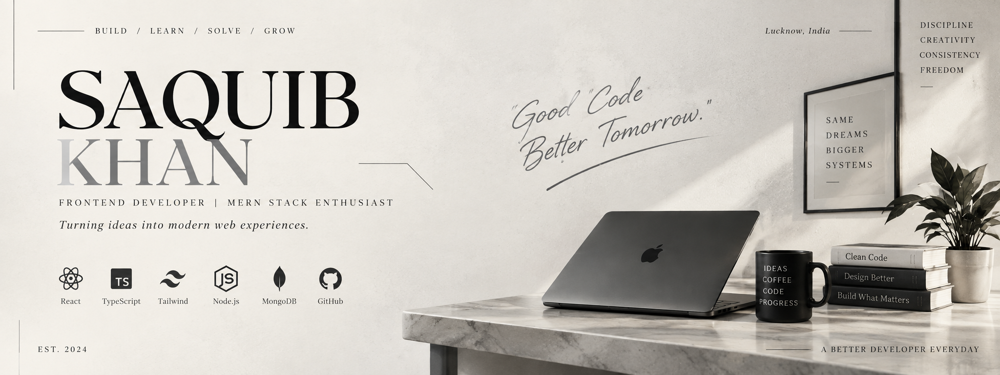

<!-- ========================================================= -->
<!--                       SAQUIB KHAN                         -->
<!--                  GITHUB PROFILE README                    -->
<!-- ========================================================= -->

<p align="center">
  
</p>

<br />

<!-- ========================================================= -->
<!--                         INTRO                             -->
<!-- ========================================================= -->

<h1 align="center">Hi, I'm Saquib Khan 👋</h1>

<p align="center">
  <strong>
    Frontend Developer building modern web applications with React,
    TypeScript, Node.js and modern UI systems.
  </strong>
</p>

<p align="center">
  <a href="https://github.com/saquibkhan-dev">
    
  </a>
  &nbsp;
  <a href="mailto:saquibkhanjava@gmail.com">
    
  </a>
  &nbsp;
  <a href="https://saquib-khan.netlify.app/">
    
  </a>
</p>

---

## 👨‍💻 About

I'm a **Frontend / Full-Stack Developer** focused on building responsive,
type-safe and production-oriented web applications.

- 🔨 Currently building: **SprintDesk — Sprint Management Dashboard**
- 📚 Learning: **Advanced React, TypeScript & scalable full-stack architecture**
- 💼 Open to: **Frontend Developer / SDE-1 / Full-Stack opportunities**
- 📍 Based in **India**

---

## 🛠️ Core Stack

<p align="left">


</p>

<p align="left">


</p>

---

# 🚀 Featured Projects

## 🏃 SprintDesk — Sprint Management Dashboard

**Full-stack-style sprint management dashboard for managing sprints,
tasks and team workflows.**

🔗 **Repository:**  
https://github.com/saquibkhan-dev/Sprint-Desk

### Highlights

- Drag-and-drop Kanban board
- Keyboard-accessible interactions using `dnd-kit`
- Bearer token authentication
- Silent token refresh
- Sprint analytics with Recharts
- Real-time notification system
- Server-state management with TanStack Query
- Client state management with Zustand

### Stack

`React 19` · `TypeScript` · `Vite` · `TanStack Query` · `Zustand` · `Tailwind CSS` · `dnd-kit` · `Recharts`

---

## 🔐 Approval Workflow System with Audit Logs

**Role-based approval platform for managing requests, approvals and
auditable workflow activity.**

🔗 **Repository:**  
https://github.com/saquibkhan-dev/Approval-Workflow-System-with-Audit-Logs

### Highlights

- Role-based access control
- Admin / Approver / Requester workflows
- Protected routes
- Normalized MySQL database schema
- Live audit logs
- Real-time approval status updates
- API testing with Postman
- Automated tests with Jest

### Stack

`React.js` · `Node.js` · `Express.js` · `MySQL` · `Jest` · `Postman`

---

## 🧾 Invoice Chaser — Freelance Invoice Management SaaS

**Invoice management SaaS MVP designed for freelancers to create,
track and manage invoices and revenue.**

🔗 **Repository:**  
https://github.com/saquibkhan-dev/Invoice-Chaser

### Highlights

- Create and manage invoices
- Invoice lifecycle:
  `Draft → Sent → Overdue → Paid`
- Live revenue dashboard
- Supabase Authentication
- Row Level Security for per-user data isolation
- Edge Functions for overdue invoice detection
- Invoice PDF generation

### Stack

`React` · `Vite` · `Tailwind CSS` · `Supabase` · `PostgreSQL` · `Edge Functions`

---

# 🧠 What I Work With

```text
Frontend
├── React
├── TypeScript
├── JavaScript
├── Tailwind CSS
├── Responsive UI
└── Component Architecture

Backend
├── Node.js
├── Express.js
├── REST APIs
├── Authentication
└── Authorization

Database
├── MongoDB
├── PostgreSQL
└── MySQL

Engineering
├── Git / GitHub
├── API Testing
├── Automated Testing
├── State Management
└── Production-oriented Development

```
📊 GitHub Activity
<p align="center"> 
 
</p> 


🐍 Contribution Graph
<p align="center"> <picture>

<source media="(prefers-color-scheme: dark)" srcset="https://raw.githubusercontent.com/saquibkhan-dev/saquibkhan-dev/output/github-contribution-grid-snake-dark.svg" />

<source media="(prefers-color-scheme: light)" srcset="https://raw.githubusercontent.com/saquibkhan-dev/saquibkhan-dev/output/github-contribution-grid-snake.svg" />


</picture> </p>


📫 Connect
<p align="center"> <a href="https://github.com/saquibkhan-dev">  </a> <a href="https://www.linkedin.com/in/saquib-khan-dev/">  </a> <a href="mailto:saquibkhanjava@gmail.com">  </a> </p>
<p align="center"> <i>Build. Learn. Solve. Improve.</i> </p> <p align="center"> <sub>Thanks for visiting my profile.</sub> </p> ```
